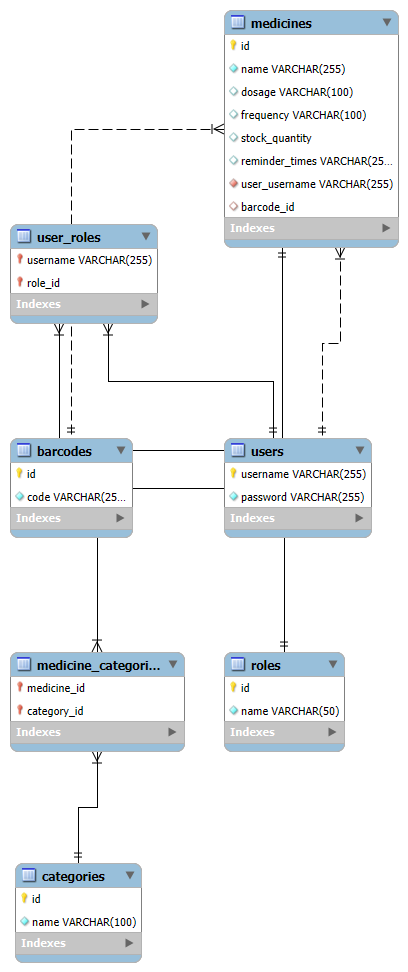

# 💊 İlaç Takip Sistemi (Medicine Tracking System)

Bu proje, kullanıcıların ilaç kullanımlarını düzenli bir şekilde takip etmelerini, stok miktarlarını yönetmelerini ve kullanım saatlerini dijital ortamda saklamalarını sağlayan **Spring Boot** tabanlı bir **RESTful** web uygulamasıdır.

## 🚀 Özellikler (Features)

* **🔐 Kullanıcı ve Rol Yönetimi:** Kullanıcıların sisteme kayıt olması ve sahip oldukları rollere (Admin, User vb.) göre yetkilendirilmesi.
* **🔍 Barkod Entegrasyonu:** Her ilacın barkod numarası ile sisteme kaydedilmesi ve hızlı sorgulanabilmesi.
* **📂 Kategorizasyon:** İlaçların türlerine göre sınıflandırılarak düzenli bir yapıda tutulması.
* **💊 İlaç Envanteri:** İlaçların ad, doz, kullanım sıklığı ve saat bilgilerine göre sisteme işlenmesi.
* **📦 Stok Takibi:** Mevcut ilaç stok miktarlarının izlenmesi ve güncellenmesi.
* **🔄 Tam CRUD Desteği:** Kullanıcı, İlaç, Kategori ve Rol kayıtları üzerinde ekleme, listeleme, güncelleme ve silme işlemleri.
* **🌐 REST Mimari:** Uygulama, modern web standartlarına uygun REST API prensipleriyle çalışır.

## 🛠️ Kullanılan Teknolojiler (Tech Stack)

* **Dil:** Java 17+
* **Framework:** Spring Boot 3.x
* **Veritabanı:** MySQL
* **Güvenlik & Yetkilendirme:** Role-Based Access Control (RBAC) - Basic Auth
* **Yapılandırma Aracı:** Maven
* **Mimari:** RESTful API

## 📊 Veritabanı Tasarımı (EER Diagram)

Projenin veritabanı mimarisi ve tablolar arası ilişkileri aşağıdaki diyagramda gösterilmiştir:

## 🧪 API Testleri (Postman)

Uygulamanın tüm fonksiyonları Postman üzerinden test edilmiş ve uç noktalar (endpoints) doğrulanmıştır. Testleri gerçekleştirmek için kök dizindeki `ilac-takip-sistemi.postman_collection.json` dosyasını kullanabilirsiniz.

### 🔑 Temel Endpoint Listesi

Aşağıdaki tablo, koleksiyon içinde yer alan ve sistemin temel işleyişini sağlayan kritik servisleri göstermektedir:

| Metot | Endpoint | Yetki | Açıklama |
| :--- | :--- | :--- | :--- |
| **POST** | `/api/users/register` | Public | Yeni kullanıcı kaydı oluşturur. |
| **POST** | `/api/users/login` | Public | Sisteme giriş yapar ve kimlik doğrulaması sağlar. |
| **GET** | `/api/user/medicines/list` | User | Giriş yapan kullanıcının kendi ilaçlarını listeler. |
| **POST** | `/api/user/medicines` | User | Sisteme yeni bir ilaç kaydı ekler. |
| **GET** | `/api/admin/medicines/list` | Admin | Sistemdeki tüm ilaçları (tüm kullanıcılar dahil) listeler. |
| **PUT** | `/api/admin/medicines/{id}` | Admin | Belirtilen ilacı tüm alanlarıyla (Tam Güncelleme) günceller. |
| **PATCH** | `/api/admin/medicines/{id}` | Admin | İlacın sadece belirli alanlarını (Kısmi Güncelleme) günceller. |
| **DELETE** | `/api/user/medicines/{id}` | User | Kullanıcının kendi ilacını sistemden tamamen siler. |
| **GET** | `/actuator/health` | User/Admin | Sistemin çalışma ve sağlık durumunu kontrol eder. |

> **Not:** Testler sırasında `base_url` değişkeninin `http://localhost:8070` olduğundan ve isteklerde **Basic Auth** bilgilerinin tanımlı olduğundan emin olun.
